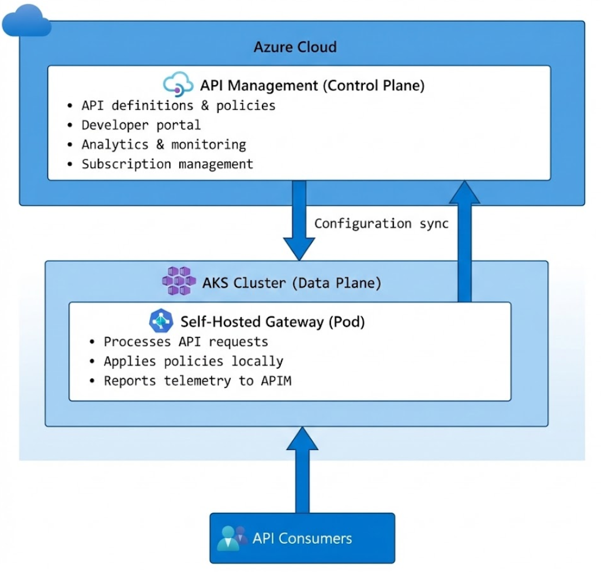

# Deploy a self-hosted gateway to Azure Kubernetes Service

This article shows you how to deploy an Azure API Management **self-hosted gateway** to Azure Kubernetes Service (AKS). You'll create a hybrid API management architecture where the control plane runs in Azure while the data plane (gateway) runs on Kubernetes.



> [!NOTE]
> This repository provides a simplified architecture for learning purposes. Production deployments require additional redundancy, security, and resilience configurations.

## Prerequisites

- Azure subscription - [create one for free](https://azure.microsoft.com/free/)
- [Azure CLI](/cli/azure/install-azure-cli) version 2.50 or later
- [kubectl](https://kubernetes.io/docs/tasks/tools/) - Kubernetes command-line tool
- [Helm 3.x](https://helm.sh/docs/intro/install/) - Kubernetes package manager
- Bash shell (WSL, Git Bash, or Linux/macOS terminal)

## Why use a self-hosted gateway?

The self-hosted gateway is a containerized version of the managed gateway component. Use a self-hosted gateway for the following scenarios:

| Scenario | Description |
|----------|-------------|
| **Low latency** | Run the gateway closer to backend services to reduce network latency |
| **Data sovereignty** | Keep API traffic within specific geographic regions for compliance |
| **Hybrid/Multi-cloud** | Deploy gateways on-premises or in other cloud providers while using Azure APIM for management |
| **Edge computing** | Process API requests at edge locations with intermittent cloud connectivity |

For more information, see [Self-hosted gateway overview](/azure/api-management/self-hosted-gateway-overview).

## Create resources

### Create resource group

Create a resource group to contain all the Azure resources.

```azurecli
az group create --name rg-apim-learn --location eastus
```

### Deploy infrastructure with Bicep

Deploy the AKS cluster, API Management instance, and self-hosted gateway resource using the provided Bicep template.

```azurecli
az deployment group create \
  --resource-group rg-apim-learn \
  --template-file main.bicep \
  --parameters baseName=apim-learn
```

> [!NOTE]
> The deployment takes approximately 10-15 minutes to complete.

The Bicep template creates the following resources:

| Resource | Description |
|----------|-------------|
| **AKS Cluster** | Single-node Kubernetes cluster with system-assigned managed identity |
| **API Management** | Consumption tier instance for API management |
| **Self-hosted gateway** | Gateway resource registered in APIM, ready for Kubernetes deployment |

### Get AKS credentials

Configure kubectl to connect to your AKS cluster.

```azurecli
az aks get-credentials \
  --resource-group rg-apim-learn \
  --name apim-learn-aks \
  --overwrite-existing
```

## Configure the self-hosted gateway

### Retrieve APIM gateway URL

Get the gateway URL from your API Management instance.

```azurecli
GATEWAY_URL=$(az apim show \
  --resource-group rg-apim-learn \
  --name apim-learn-apim \
  --query 'gatewayUrl' \
  --output tsv)

echo "APIM Gateway URL: $GATEWAY_URL"
```

### Generate gateway token

The self-hosted gateway authenticates with API Management using a SAS token. Generate a token with a 30-day expiry.

```azurecli
EXPIRY_DATE=$(date -u -d "+30 days" '+%Y-%m-%dT%H:%M:%SZ')

GATEWAY_TOKEN=$(az apim gateway generate-token \
  --resource-group rg-apim-learn \
  --gateway-id my-gateway \
  --service-name apim-learn-apim \
  --expiry $EXPIRY_DATE \
  --query 'value' \
  --output tsv)

echo "Gateway token generated (expires: $EXPIRY_DATE)"
```

> [!IMPORTANT]
> Store the gateway token securely. The token provides access to your API Management configuration. In production, use Azure Key Vault to manage secrets.

### Build configuration URL

Construct the configuration endpoint URL that the gateway uses to sync with API Management.

```azurecli
SUBSCRIPTION_ID=$(az account show --query 'id' --output tsv)
RESOURCE_GROUP="rg-apim-learn"
APIM_NAME="apim-learn-apim"
GATEWAY_NAME="my-gateway"

CONFIG_URL="${GATEWAY_URL}/subscriptions/${SUBSCRIPTION_ID}/resourceGroups/${RESOURCE_GROUP}/providers/Microsoft.ApiManagement/service/${APIM_NAME}/gateways/${GATEWAY_NAME}?api-version=2022-08-01"

echo "Configuration URL: $CONFIG_URL"
```

## Deploy the gateway to Kubernetes

### Add Helm repository

Add the official Azure API Management Helm repository.

```bash
helm repo add azure-apim-gateway https://azure.github.io/api-management-self-hosted-gateway/helm-charts/
helm repo update
```

### Create namespace

Create a dedicated Kubernetes namespace for the gateway.

```bash
kubectl create namespace apim-gateway
```

### Install the gateway

Deploy the self-hosted gateway using Helm.

```bash
helm upgrade --install apim-gateway azure-apim-gateway/azure-api-management-gateway \
  --namespace apim-gateway \
  --set gateway.configuration.uri="$CONFIG_URL" \
  --set gateway.auth.key="GatewayKey $GATEWAY_TOKEN" \
  --set replicaCount=1 \
  --set service.type=LoadBalancer
```

### Verify deployment

Wait for the gateway pod to be ready and check the deployment status.

```bash
kubectl wait --for=condition=ready pod \
  -l app.kubernetes.io/name=azure-api-management-gateway \
  -n apim-gateway \
  --timeout=300s

kubectl get pods -n apim-gateway
kubectl get svc -n apim-gateway
```

## Import a sample API

Import the Swagger Petstore API and associate it with the self-hosted gateway.

```azurecli
az deployment group create \
  --resource-group rg-apim-learn \
  --template-file import-petstore-api.bicep \
  --parameters apimName=apim-learn-apim
```

## Test the gateway

### Get external IP

Retrieve the external IP address of the gateway service.

```bash
EXTERNAL_IP=$(kubectl get svc -n apim-gateway -o jsonpath='{.items[0].status.loadBalancer.ingress[0].ip}')
echo "External IP: $EXTERNAL_IP"
```

### Call the API

Test the Petstore API through the self-hosted gateway.

```bash
# Get a pet by ID
curl http://$EXTERNAL_IP/petstore/v2/pet/1

# List pets by status
curl "http://$EXTERNAL_IP/petstore/v2/pet/findByStatus?status=available"
```

### Check gateway health

Verify the gateway is healthy.

```bash
curl http://$EXTERNAL_IP/status-0123456789abcdef
```

## Troubleshooting

### Gateway pod not starting

Check pod status and logs for errors.

```bash
kubectl get pods -n apim-gateway
kubectl logs -l app.kubernetes.io/name=azure-api-management-gateway -n apim-gateway
kubectl describe pod -l app.kubernetes.io/name=azure-api-management-gateway -n apim-gateway
```

### API not accessible

1. Verify the API is associated with the gateway in Azure portal: **API Management** > **Gateways** > **my-gateway** > **APIs**
2. Check gateway connectivity status in Azure portal: **API Management** > **Gateways** > **my-gateway**
3. Ensure the LoadBalancer has an external IP: `kubectl get svc -n apim-gateway`

### Token expired

Regenerate the token and update the Helm release.

```bash
EXPIRY_DATE=$(date -u -d "+30 days" '+%Y-%m-%dT%H:%M:%SZ')
NEW_TOKEN=$(az apim gateway generate-token \
  --resource-group rg-apim-learn \
  --gateway-id my-gateway \
  --service-name apim-learn-apim \
  --expiry $EXPIRY_DATE \
  --query 'value' --output tsv)

helm upgrade apim-gateway azure-apim-gateway/azure-api-management-gateway \
  --namespace apim-gateway \
  --reuse-values \
  --set gateway.auth.key="GatewayKey $NEW_TOKEN"
```

## Clean up resources

When you no longer need the resources, delete the resource group to avoid incurring charges.

```azurecli
az group delete --name rg-apim-learn --yes --no-wait
```

Remove the kubectl context.

```bash
kubectl config delete-context apim-learn-aks
```

## Cost estimation

| Resource | SKU/Size | Estimated cost |
|----------|----------|----------------|
| API Management | Consumption | ~$3.50 per million calls |
| AKS Cluster | Standard_B2s (1 node) | ~$30/month |
| Load Balancer | Standard | ~$18/month |
| **Total** | | **~$50/month** |

> [!TIP]
> Delete resources after learning sessions to minimize costs.

## Related content

- [Self-hosted gateway overview](/azure/api-management/self-hosted-gateway-overview)
- [Deploy self-hosted gateway to Kubernetes](/azure/api-management/how-to-deploy-self-hosted-gateway-kubernetes)
- [API Management documentation](/azure/api-management/)
- [Azure Kubernetes Service documentation](/azure/aks/)
- [Bicep documentation](/azure/azure-resource-manager/bicep/)
